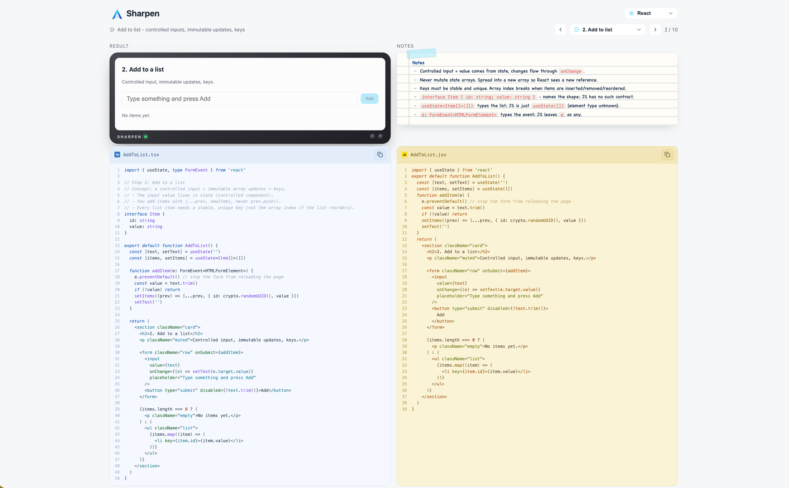

# Brush Up

[](https://github.com/bunlongheng/brushup/actions/workflows/ci.yml)

Brush Up your interview skills. 9 practice tracks in one app - **React**, **TypeScript**, **JavaScript**,
**Python**, **Rust**, **PHP**, **C**, **C++** and **C#** - 10 steps each, every step a real interview topic
with a live result or output, the real source code, and notes. Toggle tracks in the header.



## Run it

```bash
npm install
npm run dev        # http://localhost:5190
```

Then open the folder in VS Code and the app in Chrome side by side.

Requires Node 22 (`.nvmrc` and `engines` pin 22.x - run `nvm use`).

### Auth0 (optional)

Step 6 demos Auth0 login. The app runs fine without it - the step shows setup
instructions until configured:

```bash
cp .env.example .env   # then fill in VITE_AUTH0_DOMAIN and VITE_AUTH0_CLIENT_ID
```

## React track (10 steps)

Each step shows the **live result**, the code as **TypeScript vs JavaScript side-by-side** (spot the
difference), and a "what TypeScript adds here" notes box.

| #   | Topic           | File                         |
| --- | --------------- | ---------------------------- |
| 1   | Button click    | `src/steps/ButtonClick.tsx`  |
| 2   | Add to list     | `src/steps/AddToList.tsx`    |
| 3   | CRUD            | `src/steps/Crud.tsx`         |
| 4   | Fetch API       | `src/steps/FetchApi.tsx`     |
| 5   | Hooks + Context | `src/steps/HooksContext.tsx` |
| 6   | Auth0           | `src/steps/Auth0.tsx`        |
| 7   | Chart.js        | `src/steps/Charts.tsx`       |
| 8   | SQLite CRUD     | `src/steps/SqliteCrud.tsx`   |
| 9   | React Router    | `src/steps/Router.tsx`       |
| 10  | Testing         | `src/steps/Testing.tsx`      |

JS versions are hand-mirrored in `src/steps-js/` (types stripped, JSX kept) and kept in sync by
`stepsParity.test.ts`. Deep-dive docs in [`docs/`](docs/README.md).

## TypeScript track (10 steps)

Language fundamentals from hello world to advanced types. Each step **runs in the browser** and prints
its console output next to the code.

| #   | Topic                 | File                          |
| --- | --------------------- | ----------------------------- |
| 1   | Hello World           | `src/ts/HelloWorld.ts`        |
| 2   | Interfaces & Types    | `src/ts/InterfacesTypes.ts`   |
| 3   | Unions & Narrowing    | `src/ts/UnionsNarrowing.ts`   |
| 4   | Arrays, Tuples, Enums | `src/ts/ArraysTuplesEnums.ts` |
| 5   | Generics              | `src/ts/Generics.ts`          |
| 6   | Functions             | `src/ts/Functions.ts`         |
| 7   | Utility Types         | `src/ts/UtilityTypes.ts`      |
| 8   | Classes               | `src/ts/Classes.ts`           |
| 9   | Advanced Types        | `src/ts/AdvancedTypes.ts`     |
| 10  | Async                 | `src/ts/AsyncAwait.ts`        |

## Language tracks (10 steps each)

The JavaScript track runs live in the browser. Python, Rust, PHP, C, C++ and C# cannot, so each of
those steps shows the real source next to the **output recorded from a real run** (`npm run
record:lessons` refreshes every recording; `npm run verify:recordings` re-runs all 60 and fails if one drifts).

### JavaScript

Runs **live in the browser** like the TypeScript track.

| #   | Topic                   | File                                 |
| --- | ----------------------- | ------------------------------------ |
| 1   | Hello World             | `src/js/01_hello_world.js`           |
| 2   | Arrays & Objects        | `src/js/02_arrays_objects.js`        |
| 3   | Functions & Closures    | `src/js/03_functions_closures.js`    |
| 4   | Scope & Hoisting        | `src/js/04_scope_hoisting.js`        |
| 5   | Prototypes & Classes    | `src/js/05_prototypes_classes.js`    |
| 6   | this Binding            | `src/js/06_this_binding.js`          |
| 7   | Promises & async        | `src/js/07_async_promises.js`        |
| 8   | Event Loop              | `src/js/08_event_loop.js`            |
| 9   | Iterators & Generators  | `src/js/09_iterators_generators.js`  |
| 10  | Immutability & Patterns | `src/js/10_immutability_patterns.js` |

### Python

Recorded from a real `python3` run.

| #   | Topic                     | File                                    |
| --- | ------------------------- | --------------------------------------- |
| 1   | Hello World               | `src/python/01_hello_world.py`          |
| 2   | Collections               | `src/python/02_collections.py`          |
| 3   | Control Flow              | `src/python/03_control_flow.py`         |
| 4   | Functions                 | `src/python/04_functions.py`            |
| 5   | Classes & Dataclasses     | `src/python/05_classes.py`              |
| 6   | Errors & Context Managers | `src/python/06_errors_context.py`       |
| 7   | Iterators & Generators    | `src/python/07_iterators_generators.py` |
| 8   | Type Hints                | `src/python/08_type_hints.py`           |
| 9   | Decorators & functools    | `src/python/09_decorators_functools.py` |
| 10  | Async                     | `src/python/10_async.py`                |

### Rust

Recorded from a real `rustc -O` build.

| #   | Topic                 | File                                 |
| --- | --------------------- | ------------------------------------ |
| 1   | Hello World           | `src/rust/01_hello_world.rs`         |
| 2   | Ownership & Borrowing | `src/rust/02_ownership_borrowing.rs` |
| 3   | Structs & Enums       | `src/rust/03_structs_enums.rs`       |
| 4   | Collections           | `src/rust/04_collections.rs`         |
| 5   | Error Handling        | `src/rust/05_error_handling.rs`      |
| 6   | Traits & Generics     | `src/rust/06_traits_generics.rs`     |
| 7   | Lifetimes             | `src/rust/07_lifetimes.rs`           |
| 8   | Iterators & Closures  | `src/rust/08_iterators_closures.rs`  |
| 9   | Smart Pointers        | `src/rust/09_smart_pointers.rs`      |
| 10  | Concurrency           | `src/rust/10_concurrency.rs`         |

### PHP

Recorded from a real `php` run (PHP 8).

| #   | Topic                    | File                                  |
| --- | ------------------------ | ------------------------------------- |
| 1   | Hello World              | `src/php/01_hello_world.php`          |
| 2   | Arrays                   | `src/php/02_arrays.php`               |
| 3   | Strings & Types          | `src/php/03_strings_types.php`        |
| 4   | Functions & Closures     | `src/php/04_functions_closures.php`   |
| 5   | Classes                  | `src/php/05_classes.php`              |
| 6   | Inheritance & Traits     | `src/php/06_inheritance_traits.php`   |
| 7   | Exceptions               | `src/php/07_exceptions.php`           |
| 8   | Generators & Iterators   | `src/php/08_generators_iterators.php` |
| 9   | Null Safety & Modern PHP | `src/php/09_null_safety_modern.php`   |
| 10  | JSON & Regex             | `src/php/10_json_regex.php`           |

### C

Recorded from a real `clang -std=c17 -Wall -Wextra` build.

| #   | Topic                  | File                              |
| --- | ---------------------- | --------------------------------- |
| 1   | Hello World            | `src/c/01_hello_world.c`          |
| 2   | Control Flow           | `src/c/02_control_flow.c`         |
| 3   | Functions              | `src/c/03_functions.c`            |
| 4   | Pointers               | `src/c/04_pointers.c`             |
| 5   | Arrays & Strings       | `src/c/05_arrays_strings.c`       |
| 6   | Structs & Enums        | `src/c/06_structs_enums.c`        |
| 7   | Dynamic Memory         | `src/c/07_dynamic_memory.c`       |
| 8   | Function Pointers      | `src/c/08_function_pointers.c`    |
| 9   | Bit Manipulation       | `src/c/09_bit_manipulation.c`     |
| 10  | Preprocessor & Modules | `src/c/10_preprocessor_modules.c` |

### C++

Recorded from a real `clang++ -std=c++20 -Wall -Wextra` build.

| #   | Topic                         | File                                         |
| --- | ----------------------------- | -------------------------------------------- |
| 1   | Hello World                   | `src/cpp/01_hello_world.cpp`                 |
| 2   | Strings & Vectors             | `src/cpp/02_strings_vectors.cpp`             |
| 3   | Classes & RAII                | `src/cpp/03_classes_raii.cpp`                |
| 4   | Smart Pointers                | `src/cpp/04_smart_pointers.cpp`              |
| 5   | Templates & Concepts          | `src/cpp/05_templates_concepts.cpp`          |
| 6   | STL Algorithms                | `src/cpp/06_stl_algorithms.cpp`              |
| 7   | Maps & Sets                   | `src/cpp/07_maps_sets.cpp`                   |
| 8   | Inheritance & Polymorphism    | `src/cpp/08_inheritance_polymorphism.cpp`    |
| 9   | Exceptions, optional, variant | `src/cpp/09_exceptions_optional_variant.cpp` |
| 10  | Move Semantics                | `src/cpp/10_move_semantics.cpp`              |

### C#

Recorded from a real `dotnet run -c Release` build.

| #   | Topic                    | File                                     |
| --- | ------------------------ | ---------------------------------------- |
| 1   | Hello World              | `src/csharp/01_HelloWorld.cs`            |
| 2   | Types & Collections      | `src/csharp/02_TypesCollections.cs`      |
| 3   | Control Flow             | `src/csharp/03_ControlFlow.cs`           |
| 4   | Methods                  | `src/csharp/04_Methods.cs`               |
| 5   | Classes & Records        | `src/csharp/05_ClassesRecords.cs`        |
| 6   | Interfaces & Inheritance | `src/csharp/06_InterfacesInheritance.cs` |
| 7   | LINQ                     | `src/csharp/07_Linq.cs`                  |
| 8   | Exceptions               | `src/csharp/08_Exceptions.cs`            |
| 9   | Generics & Delegates     | `src/csharp/09_GenericsDelegates.cs`     |
| 10  | Async                    | `src/csharp/10_Async.cs`                 |

## Commands

```bash
npm test          # Vitest + React Testing Library
npm run lint      # eslint .
npm run typecheck # tsc --noEmit
npm run format    # prettier --write .
npm run format:check   # prettier --check . (CI)
npm run test:coverage  # vitest + v8 coverage, 70% gate (CI)
npm run record:lessons # re-record every recorded track's stdout
npm run verify:recordings # re-run all 60 recorded lessons and diff against the recordings
npm run build     # typecheck + production build
```

## Code viewer

- **TS vs JS side-by-side** - per-language editor themes (blue for TypeScript, sand for JavaScript).
- **Copy** - copy the shown code.
- Font size adapts to screen width (phone through desktop).
- **A- / A+** - nudge the code font up or down in any code panel (on top of the screen-width default).

## App

- **Deep links** - every lesson has a URL (`#react/3`, `#rust/7`, `#csharp/5`) that survives refresh and can be shared.
- **Dark mode** - toggle in the header, remembered per browser.
- **Installable** - ships a web manifest and icons, so it can be added to a home screen.
- **Resilient** - each lesson is its own lazy chunk behind an error boundary; a crash in 1 step never
  takes down the shell.

## Live demo

Deployed to Vercel on every push to main: https://brushup-bheng.vercel.app

## License

MIT - see [LICENSE](LICENSE).
